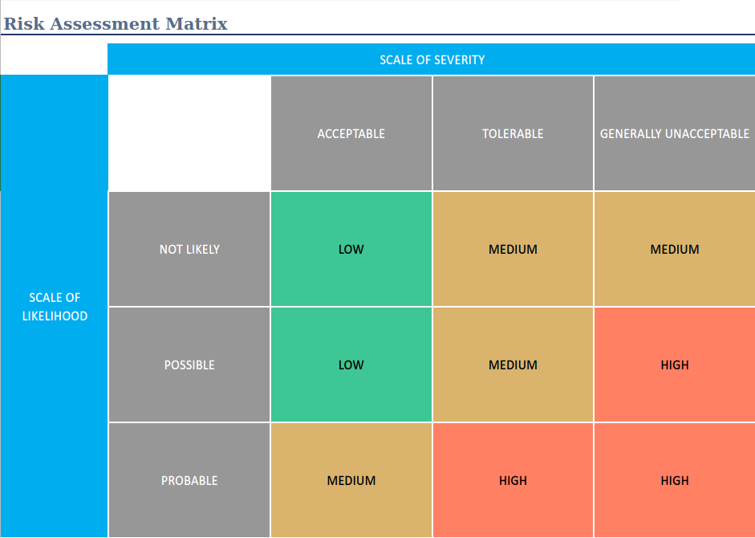

# Houseplants care app
I have a large collection of houseplants and I had an idea for a simple, easy to use app to keep track of their care requirements, such as watering, fertilising and repotting. This project aimed at creating a basic version of this app, which can come in handy when I need to prepare watering instructions for my partner or troubleshoot any issues with individual plants.

# Design

## Project specification
This project's objective is to create a CRUD web application with Python and Flask. The project aimed to demonstrate proficiency in a range of concepts and skills, including:

* Project Management
* Python Fundamentals
* Python Testing
* Git
* Basic Linux
* Python Web Development
* Continuous Integration
* Cloud Fundamentals
* Databases

## Scope
An important aspect of the project was to adjust the level of complexity of the app to fit into the scope and timeline of the assignment. This required brainstorming any possible functions and prioritising the essential ones. Two key elements emerged:

* Storing general information about plants, which can be updated and deleted if required
* Storing information about the watering schedule

## Database design
The essential elements of the database were established in advance and visualised with an ERD chart, which demonstrates the relationship between the tables. Additional tables can easily be added in the future as more features are added to the app. The ERD was designed with Lucidchart.

# Project management

## Workflow
A Trello board was the main project management tool used. The board developed along with the project as my knowledge increased. Initially, it only included user stories with main features. Later I was able to decompose each story into smaller tasks. In addition to the MVP elements, I also added additional tasks which can be carried out to expand the app. I updated the board daily. Several times it became clear that what I initially thought was essential was not as important - and vice versa, so I adjusted the plan accordingly.

<figure>

<figcaption> Early version of the board with user stories. </figcaption>
</figure>

<figure>

<figcaption> Trello board expanded with individual tasks </figcaption>
</figure>

## CI Pipeline

## Risk assessment

## Unit testing

Unit testing with Pytest was implemented for automated testing of the CRUD functionality.The tests aimed to check if records can be added, updated and deleted in both tables, including cases where a houseplant record has dependants in the watering table. A coverage of 80% was achieved.

# Evaluation

Overall the project was successful in achieving the MVP in the time available. It was particularly useful to focus on prioritising tasks to ensure that a well functioning app was completed before adding features and small improvements. Of course, there were also challenges and learning points.

## What I would have done differently
I found effective unit testing to be a challenging concept. In the future I would like to learn more and introduce a wider range of more sophisticated tests (e.g. random values). I will also introduce unit testing earlier in the process.

Some issues arose from failing to regularly update the requirements/pipfiles on the remote repository which affected the portability of the app. Running builds with Jenkins on a different machine were helpful in catching these problems.

## Possible additions and improvements

* Search bar.
* More care features (fertilising, repotting, pruning, pest control).
* Adding images representing the plants and their condition.
* Editable fields to customise the information that can be entered in the plant records.
* Predicting houseplants to be watered soon based on past watering frequency. Machine learning.
* Mobile app.

## Versions
v.1.0 includes a basic version of the watering feature. It enables the user to 'water' a plant (i.e. add a watering record linked to the record of a houseplant) with one click of the button. The watering date is assumed to be today's date, and the last watering date becomes visible in the plant record.

v.2.0 adds a more advanced watering feature, which allows the user to backdate waterings and view as well as edit past waterings in case of a user error.